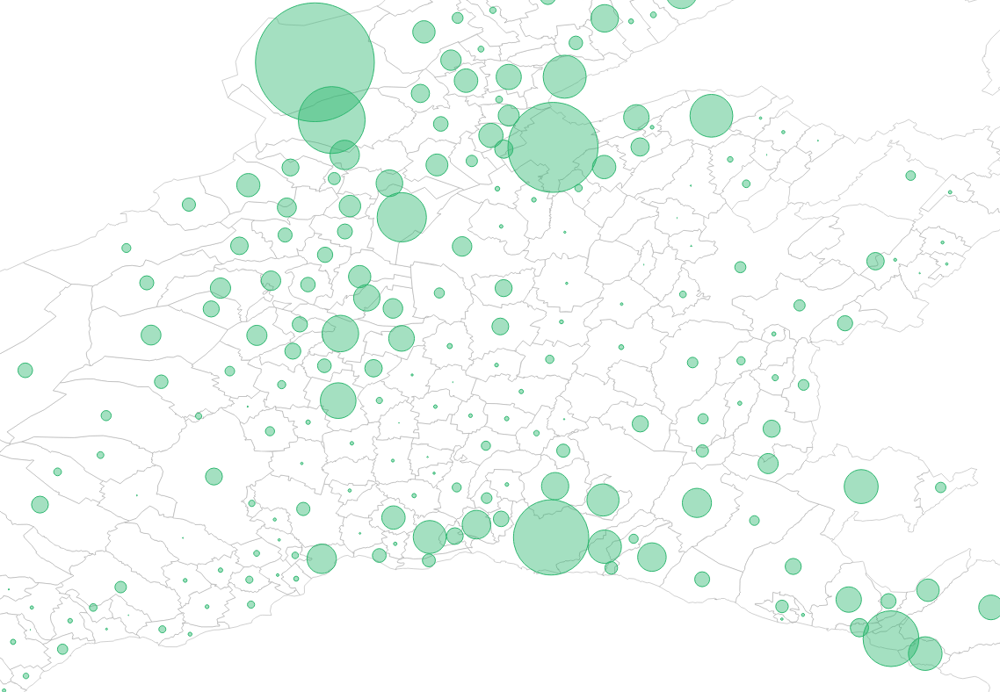

# Examen Visualdon - 26 juin 2024

Le travail sera rendu au plus tard à 16h15, par e-mail à noemi.romano@heig-vd.ch.

Vous rendrez un **fichier ZIP** de tout votre projet excepté le dossier "node_modules" et vous donnerez votre nom de famille, prénom et classe à ce dossier (*nom_prenom_classe.zip*). Vous êtes responsable de son contenu et devez vous assurer de la bonne réception du dossier avant de quitter la salle.

## Installation
* Clonez la [repository](https://github.com/romanoe/examen-visualdon-24/) 
  
 ```bash
git clone https://github.com/romanoe/examen-visualdon-24.git
  ```

* Rentrez dans le dossier *examen-visualdon-24* : 
  
```bash 
cd examen-visualdon-24
```

* Installez les packages nécessaires : ```
 
```bash
npm install
```

* Démarrez le serveur : 
  
```bash
npm run dev
```

:rocket: Vous devriez avoir accès à votre serveur local sur [localhost:5173](http:localhost:5173) :rocket:

## Exercice 1 - SVG (15 points)
Reproduire le dessin suivant dans le navigateur à l’aide des outils que vous avez appris en cours.

> :exclamation: La grille est à titre indicatif et elle ne doit pas être dessinée.


## Exercice 2 - Les arbres du canton de Vaud (15 points)
Vous avez à disposition les données Openstreetmap des arbres du canton de Vaud.  

S'agissant d'un fichier `geojson`, la composante géographique est directement dans les données. Les données sont structurées de la manière suivante :

* `id` : identifiant commune
* `name`: nom de la commune (p. ex. _Yverdon les bains_)
* `n_trees` : nombre d'arbres
* `area_km2`: superficie de la commune en km²

Apportez les manipulations suivantes et imprimez les résultats dans la console :

1. La **commune** ayant le plus grand nombre d'arbres par km² :dart: **5 points** :dart:
2. Les 10 communes qui ont le plus grand nombre d'arbre par km² :dart: **5 points** :dart:
3. Le nombre moyen d'arbre par km² dans l'ensemble du canton de Vaud :dart: **5 points** :dart:


## Exercice 3 - Visualisations (70 points)
Avec les donnés de l'exercice précédent, produisez les visualisations suivantes :

### 3.1 Carte choroplète (25 points)


1. Visualisez une carte choroplète des communes selon le **n_trees** par km² :dart: **10 points** :dart:

2. Rajoutez une info-bulle quand vous survolez sur les communes avec les informations suivante : **nom de la commune** et **nombre d'arbres par km²** :dart: **10 points** :dart:
  
3. Quel est votre avis par rapport à ce genre de visualisation ? Il y a t'il des biais ? Quel type de réprésentation serait la plus adaptée ? Imprimez la réponse dans la console. :dart: **5 points** :dart:


### 3.2 Carte à bulle (25 points)

Nous allons reproduire une carte à bulles (bubble map), comme ci-dessous :



Pour ce faire, vous disposez d'un deuxième jeu de données (data/centroids_vd.geojson) qui contient les coordonnées des centres des communes (en latitude et longitude) du canton de Vaud, avec les informations suivantes :

* `id` : identifiant commune
* `name`: nom de la commune (p. ex. _Lausanne_)

Veuillez suivre les instructions suivantes :

1. Construisez une carte comme dans l'image ci-dessus, en utilisant le nombre d'arbres par km² comme rayon, avec une échelle adaptée :dart: 10 points :dart:

2. Rajoutez une info-bulle si on survole avec la souris :dart: **10 points** :dart:

3. Créez une animation d'entrée pour les cercles (r=0 à r=**nombre d'arbres par km²**`)  :dart: **5 points** :dart:


### 3.3 Diagramme en bâtons (20 points)

1. Créez un diagramme en bâton horizontal (horizontal barchart) en ayant en axe Y les _noms des communes_ et en axe X le _nombre d'arbres par km²_. (N'oubliez pas les axes !) :dart: **15 points** :dart:

   
2. Créez une animation d'entrée des rectangles  :dart: **5 points** :dart:
