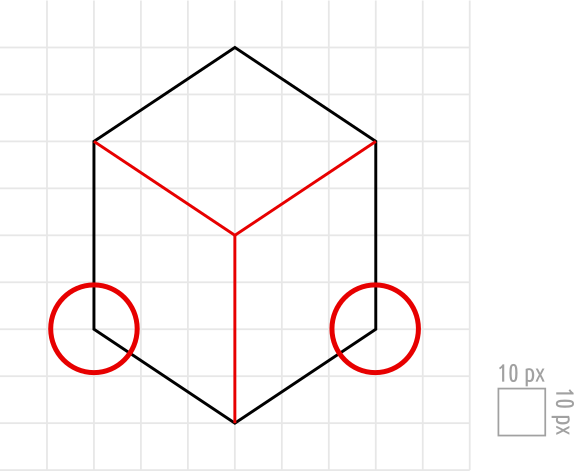
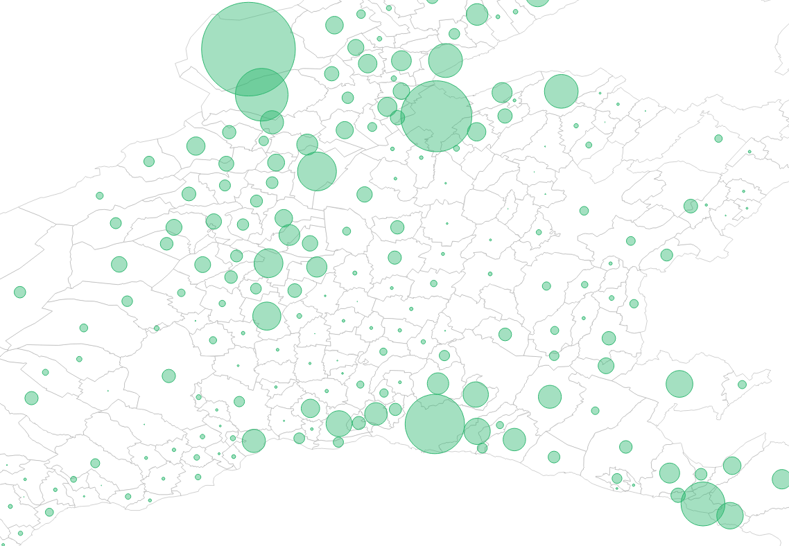

# Examen Visualdon - 26 juin 2024

Le travail sera rendu au plus tard à 16h15, par e-mail à noemi.romano@heig-vd.ch.

Vous rendrez un **fichier ZIP** de tout votre projet excepté le dossier `node_modules` et vous donnerez votre nom de famille, prénom et classe à ce dossier (*nom_prenom_classe.zip*). Vous êtes responsable de son contenu et devez vous assurer de la bonne réception du dossier avant de quitter la salle.

Pour accéder à la version en ligne de la donnée de l'examen, visitez [https://github.com/romanoe/examen-visualdon-24/](https://github.com/romanoe/examen-visualdon-24/)

## Installation

Clonez ou téléchargez le zip de ce [dossier]([https://github.com/romanoe/examen-visualdon-24/](https://github.com/romanoe/examen-visualdon-24/archive/refs/heads/main.zip)) 

* **SSH**: `git clone git@github.com:romanoe/examen-visualdon-24.git`
  
* ou **HTTPS**: `git clone https://github.com/romanoe/examen-visualdon-24.git`

Rentrez dans le dossier *examen-visualdon-24* : `cd examen-visualdon-24`


Installez les packages nécessaires : 
 
```bash
npm install
```

Démarrez le serveur : 
  
```bash
npm run dev
```

Vous devriez avoir accès à votre serveur local sur [localhost:5173](http:localhost:5173) 

Complétez les fichiers `index.html` et `src/index.js` afin de réaliser les exercices demandés.


## Exercice 1 - SVG (15 points)
Reproduire le dessin suivant dans le navigateur à l’aide des outils que vous avez appris en cours.

La grille et la légende sont fournies à titre indicatif et ne doivent pas être dessinées.




## Les arbres du canton de Vaud

### Données

Pour la suite des exercices, vous avez à disposition deux jeux de données, extraits de OpenStreetMap et agrégés aux communes du canton Vaud : 

1.  `data/arbres_communes.geojson` : Les limites des communes avec le nombre d'arbres pour chacune des communes  
2.  `data/centres_communes.geojson`: Les centres géométriques des communes 


S'agissant de fichiers `geojson`, la composante géographique est directement dans les données (`geometry`). Les données sont structurées de la manière suivante :

#### `data/arbres_communes.geojson` 

* `id` : identifiant commune
* `name`: nom de la commune 
* `n_trees` : nombre d'arbres
* `area_km2`: superficie de la commune en km²

```js
{
  "type": "FeatureCollection",
  "name": "arbres_communes",
  "crs": { "type": "name", "properties": { "name": "urn:ogc:def:crs:OGC:1.3:CRS84" } },
  "features": 
         [
         // ...
          { 
           "type": "Feature", 
           "properties": { 
                          "id": 5938,                    // identifiant commune
                          "name": "Yverdon-les-Bains",   // nom de la commune 
                          "n_trees": 10492,              // nombre d'arbres
                          "area_km2": 16.398             // superficie de la commune en km²
                         },
           "geometry": { "type": "MultiPolygon", "coordinates": [[ 7.129220679418326, 46.295676327855247 ], [ 7.13186469337102, 46.297219511844851 ], [ 7.133027869706181, 46.297089165366003 ]]]
           },
         // ..
         ],
        
}
```


 
\pagebreak


#### `data/centres_communes.geojson`

* `id` : identifiant commune
* `name`: nom de la commune 

```js
{
  "type": "FeatureCollection",
  "name": "centres_communes",
  "crs": { "type": "name", "properties": { "name": "urn:ogc:def:crs:OGC:1.3:CRS84" } },
  "features": 
         [
         // ...
          { 
           "type": "Feature", 
           "properties": { 
                          "id": 5938,                    // identifiant commune
                          "name": "Yverdon-les-Bains",   // nom de la commune
                         },
            "geometry": { "type": "Point", "coordinates": [ 6.637331313021409, 46.770610904896785 ] }          
          },
       // ..
        ],
}
```

La clé commune entre les deux jeux de données est l'identitifiant (`id`). 


## Exercice 2 - Manipulations des données (15 points)

Apportez les manipulations suivantes et imprimez les résultats dans la console :

1. La **commune** ayant le plus grand nombre d'arbres par km²  **5 points** 
2. Les **10 communes** qui ont le plus grand nombre d'arbres par km²  **5 points** 
3. Peut-on considérer les données sur les arbres extraites d'OpenStreetMap comme fiables ? Quelles autres entités pourraient fournir des données alternatives ou complémentaires ?   **5 points** 


## Exercice 3 - Visualisations (70 points)
Avec les données de l'exercice précédent, utilisez les outils que vous avez appris en cours pour créer les visualisations suivantes. 

> **D3.js** et **Leaflet** sont déjà installés et importés dans `src/index.js` (à vous le choix d'utiliser l'un et/ou l'autre pour les exercices de cartographie). Si vous souhaitez utiliser une autre bibliothèque, vous devez l'installer à l'aide de `npm` et l'importer de la même manière.

### 3.1 Carte choroplète (25 points)


1. Visualisez une carte choroplète de toutes les communes en fonction du **nombre d'arbres par km²**. Pour cet exercice, vous utiliserez `data/arbres_communes.geojson`, qui contient les limites des communes, le nombre d'arbres (`n_trees`) ainsi que la surface de chacune des communes (`area_km2`).    **10 points** 

2. Ajoutez une info-bulle qui affiche le **nom de la commune** et le **nombre d'arbres par km²** lorsque survolées. De plus, augmentez l'épaisseur de la limite communale lors du survol.  **10 points** 
  
3. Intégrez un titre et une légende à la carte.  **5 points** 


### 3.2 Carte à bulles (25 points)

Nous allons reproduire une carte à bulles (bubble map), comme ci-dessous :




Veuillez suivre les instructions suivantes :

1. Construisez une carte comme dans l'image ci-dessus, en utilisant le **nombre d'arbres par km²** comme rayon des cercles. Pour cet exercice, vous aurez besoin de `data/centres_communes.geojson` pour l'emplacement des cercles, ainsi que `data/arbres_communes.geojson` pour avoir le nombre d'arbres et les limites pour chacune des communes.   **10 points** 

2. Rajoutez une info-bulle si on survole avec la souris  **10 points** 

3. Justifiez le choix du type d'échelle que vous avez choisi pour le rayon des cercles   **5 points** 


### 3.3 Diagramme en bâtons (20 points)

1. Créez un diagramme en bâton horizontal (horizontal barchart) des **10 communes** ayant le plus grand nombre d'arbres par km², avec en axe Y les **noms des communes** et en axe X le **nombre d'arbres par km²**   **15 points** 

   
2. Implémentez une animation d'entrée avec une fonction d'accélération de votre choix.  **5 points** 

